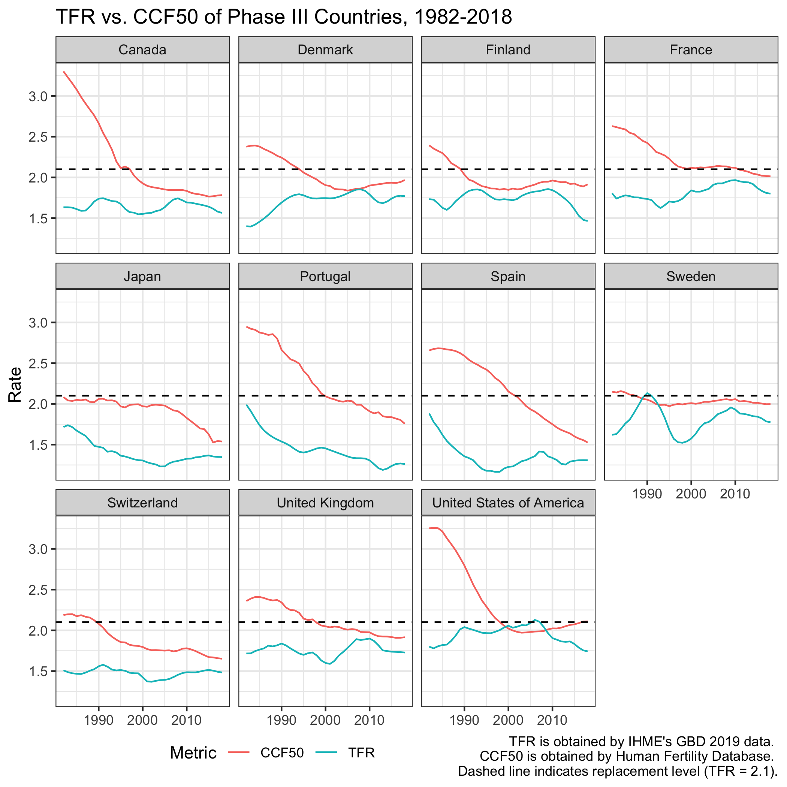
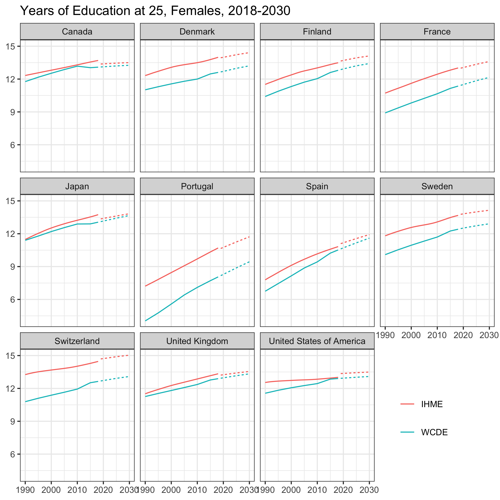
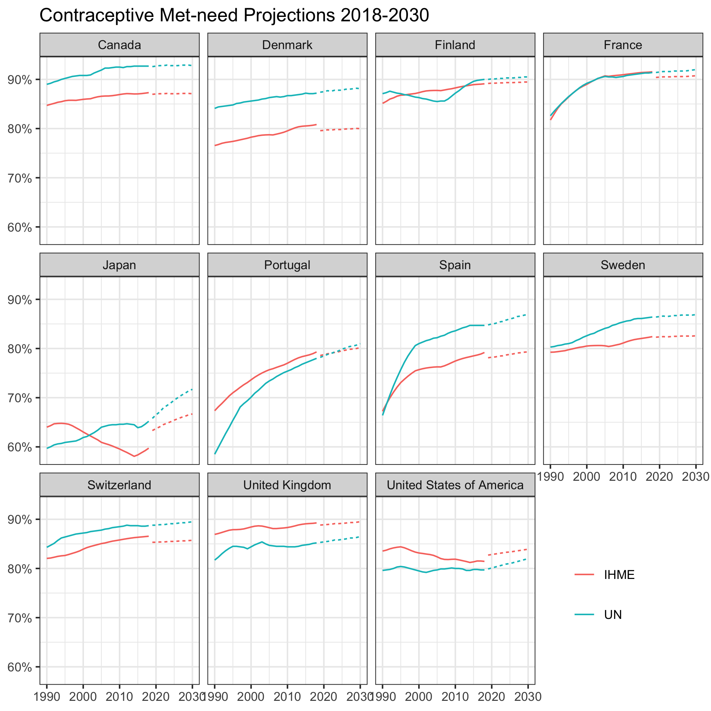

```{r setup, include=FALSE}

gr <- 2 / (1 + sqrt(5))

knitr::opts_chunk$set(echo = FALSE, warning = FALSE, fig.asp = gr)
options(knitr.kable.NA = '-')

rm(gr)
```

```{r prep, include=FALSE}
# Prep work ---------------------------------------------------------------
# Load libraries
library(forecast)
library(nlme)
library(splines)
library(tidyverse)
library(bayesTFR)
library(modelsummary)

# Control randomness
set.seed(57)
options(scipen = 999)


# Data
data = readRDS("data/cov_projections.RDS")
train = data %>% filter(pred == 0)
test = data %>% filter(pred == 1) %>% select(-tfr, -ccf50)
#mcmc = bayesTFR::get.tfr.mcmc("bayesTFR.output/")
mcmc3 = bayesTFR::get.tfr3.mcmc("bayesTFR.output/")
                                             
```

```{r}
# Random Walk models for each country
many_arima = function(data, orders = c(0,1,0)){
  df_list  = data %>% group_by(country) %>% group_split()
  preds = list()
  for(df in df_list){
    df = df %>% select(country, year, ccf50, edu, mn, pred) %>% arrange(year)
    train = df %>% filter(pred == 0) 
    test = df %>% filter(pred == 1) %>% select(!ccf50)
    # extract time series and covariates
    old_reg = train %>% select(mn, edu) %>% as.matrix()
    new_reg = test  %>% select(mn, edu) %>% as.matrix()
    ts = ts(data = train$ccf50, start = 1982, frequency = 1)
    arima_fit = Arima(ts, order = orders, xreg = old_reg)
    pred = forecast::forecast(arima_fit, h = 12, xreg = new_reg)
    preds[[as.character(df$country[[1]])]] = pred
  }
  return(preds)
}

```

```{r lme models, echo=FALSE}
# LME models
m1 <- nlme::lme(# A formula object including the response,
  # the fixed covariates, and any grouping variables
  data = train, 
  fixed = ccf50 ~ mn + ns(edu),
  # The random effects component
  random = ~ 1 | country)

m2 <- nlme::lme(# A formula object including the response,
  # the fixed covariates, and any grouping variables
  data = train, 
  fixed = ccf50 ~ 1,
  # The random effects component
  random = ~ 1 | country,
  # The TS dynamics: specify the time & group variables,
  # and the and the AR(1) errors.
  correlation = corARMA(form = ~ year | country, p = 1, q = 0))

m3 <- nlme::lme(# A formula object including the response,
  # the fixed covariates, and any grouping variables
  data = train, 
  fixed = ccf50 ~ mn + edu,
  # The random effects component
  random = ~ 1 | country,
  # The TS dynamics: specify the time & group variables,
  # and the AR(1) errors.
  correlation = corARMA(form = ~ year | country, p = 0, q = 1))

m4 <- nlme::lme(# A formula object including the response,
  # the fixed covariates, and any grouping variables
  data = train, 
  fixed = ccf50 ~ mn + ns(edu),
  # The random effects component
  random = ~ 1 | country,
  # The TS dynamics: specify the time & group variables,
  # and the AR(1) errors.
  correlation = corARMA(form = ~ year | country, p = 1, q = 1))


lme_models = list(`i.i.d` = m1, `ARMA(1,0)` = m2, `ARMA(0,1)` = m3, `ARMA(1,1)` = m4)
lme_coef = c(
  "(Intercept)" = "Mean", "mn" =  "Met-need",  "ns(edu)" = "Education")
lme_gm <- tribble(
  ~raw,    ~clean, ~fmt,
  "nobs",  "N",     0,
  "sigma", "Sigma", 2,
  "aicc",  "AICc",  0,
  "bic",   "BIC",   0)
```

\newpage

## Introduction

This review discuss three papers:
(@vollsetFertilityMortalityMigration2020; @alkemaGlobalBurdenDisease2020;
@gietel-bastenUncertainPopulationFutures2020) The first paper introduces
a new method for population projections and claims widely different
forecasts. The remaining two papers criticize the proposed approach.
Henceforward, a debate among demographers is emerged and this review
focused on fertility projections -- arguably the center point on this
debate. The paper is organized as follows: (I) summary of the debate on
fertility projections, (II) replicating the fertility part of Vollset
et.al (2020) article, (III) evaluation against other methods, (IV)
discussion.

## Article Summary

Demographers are well aware of the problems emerged from using period
fertility rates in population projections. Unlike life tables, fertility
behavior shows a different age pattern between cohort and period
measures. This is especially true for countries in Phase III which is
defined by Alkema et al. (2011):

> "The countries that have entered Phase III are defined as the
> countries in which two subsequent five-year increases below a TFR of 2
> children have been observed."

In Phase III countries women delay childbearing to later ages, aka tempo
effect. As a result, period Total Fertility Rate (TFR) shows an increase
in recent years. This increase occurs because of how TFR calculated, not
empirically observed. TFR is calculated from summing Age-Standardized
Fertility Rates in a given period. Therefore, women who child-bear at
later ages contribute to the that period's fertility rate. This creates
an illusion of decreasing fertility declines in future future years.

In contrast, Completed Cohort Fertility Rates doesn't suffer from tempo
effect, as they are derived based on observing a cohort of women through
ages 15-49. In practice, cohort's total fertility estimated
retrospectively from a survey of 50-year-old women. Complete Cohort
Fertility at Age 50 (CCF50) calculated as the total number of births
among women in the cohort divided by the number of women in the cohort.
Briefly, a cohort's total fertility rate can be derived entirely from
its set of parity progression ratios.
@prestonDemographyMeasuringModeling2001

Figure I shows the difference between TFR and CCF50 for 11 countries in
Phase III. As seen in Figure 1, both TFR and CCF50 start with a
decreasing trend. While CCF50 slowly approaches to a stable level, TFR
increases as a result of tempo effect. Note that estimates obtained from
different data sources, therefore there is a difference in the
magnitudes. However, what matters for the population projections is the
change in the fertility rates comparing to previous years, as they are
projected with auto-regressive time series models.

Vollset et al. (2020) paper's proposed population projection method
mainly differs using CCF50 instead of TFR. The resulting model fits
better to Western countries, as majority of them in Phase III.
Consequently, they argue that population decline is becoming a serious
threat in the future (2050). Using a cohort measure instead of a period
measure is not a novel idea. What makes TFR prevalent in population
projections is convenience. In most countries, obtaining age-specific
birth counts in a period is a lot easier than complete cohort fertility.
More importantly, using CCF50 requires adjustments for incomplete birth
cohorts. For instance, CCF50 in 2015 is estimated from birth cohort of
1965. Women who born after 1965 are not completed cohort, so their
cohort fertility rate needs to be completed until the age of 50. Such a
challenge is not applicable when using period TFR.

Vollset et al. (2020) provides a novel solution to the this problem.
Instead of projecting CCF50 for future years, they utilized two
covariates that are highly correlated with CCF50, namely contraceptive
met need and maternal educational attainment (years of education). In
their models, they found that a model with those two covariates accounts
for 80.5% of the variance in CCF50. The details on this model and CCF50
projections are discussed in the next chapter.

Several objections made to this model and resulting population
estimates. Alkema (2020) shows that Vollset et al. models actually
resulted in better estimates in Western countries but cautions the
reader about potential over-fitting issues. As Vollset (2020) didn't
present any out-of-sample predictions, it is possible that IHME tuned
the model parameters to support their claim about CCF50. Gietel-Basten &
Sobotka (2020) supports this suspicion by stating that IHME models used
a one child per woman lower limit when predicting cohort fertility
rates, in the absence of an upper limit. Since there is no justification
for these decisions provided in Vollset et Al. (2020), there is a need
for further scrutiny.

```{r, echo = FALSE, fig.cap="Period vs. Cohort"}


```

## Data Sources

Vollset et al. uses the Institute for Health Metric's (IHME) Global
Burden of Disease (GBD) 2017 data. IHME has a policy to comply with
GATHER research rules. Consequently, GBD data should be easily obtained
from IHME's website and Vollset et al. paper's results should be
reproducible. However, after closer looking in the up to date GBD 2019
data and IHME's public Github repo, I realized that this is far from
being true. GBD 2019 data doesn't include any cohort fertility measures,
but only period TFR projections. When it comes to covariates, IHME only
published observed data. In the Github repo, there are R and Python
scripts to generate the projections, however they rely on internal and
non-public data in IHME's database. I also verified this by contacting
the fertility projections team. In summary, exact replication of Vollset
et al. study is unfortunately not possible.

As an alternative, I used three additional data sources:

-   CCF50: Human Fertility Database (HFD) publishes cohort fertility
    measures for 11 number of countries for cohorts 1932 - 1968,
    respectively year 1992-2018 when completed.

-   Met-need: United Nations (UN) publishes contraceptive prevalence and
    satisfied contraceptive demand estimates and projections for all
    countries in 1990-2030.

-   Educational Attainment: Wittgenstein Center provides Human Capital
    data that includes age and sex specific mean years of education from
    1950-2100 in five year periods.

| Variable                  | Observed (1982-2018)     | Projected (2019-2030)    |
|-------------------------|-------------------------|-----------------------|
| Complete Cohort Fertility | Human Fertility Database | Human Fertility Database |
| Total Fertility Rate      | Global Burden of Disease | Global Burden of Disease |
| Contraceptive Met-need    | Global Burden of Disease | United Nations           |
| Educational Attainment    | Global Burden of Disease | Wittgenstein Center      |
Table1: **Data sources used in this paper.**

## Data Processing

Table I presents the variables, sources of estimates and projections in
this paper. In order to combine multiple data sources, I performed the
following processing steps:

-   List of Phase III countries available in all data sets are *Canada,
    Denmark, Finland, France, Japan, Portugal, Spain, Sweden,
    Switzerland, United Kingdom, United States of America*.

-   Time period available for those countries is 1982-2030.

-   HFD published cumulative cohort fertility in one-year age groups.
    Note that cumulative cohort fertility at age 50, the assumed end of
    reproductive lifespan, equals CCF50 (Vollset et al. 2020)

-   Wittgenstein Center's 5-year interval estimates extended to yearly
    estimates using linear interpolation method.

-   GBD's educational attainment data is modeled as a function of
    Wittgenstein Center's mean years of education estimates
    ($R^2=0.98)$. Using this model, GBD's educational attainment is
    forecasted up to 2030. (see Figure 2)

-   GBD's contraceptive met-need covariate modeled as a function of UN's
    satisfied contraceptive demand estimates ($R^2=0.97)$. Using this
    model, future IHME met-need is forecasted. (see Figure 3)

```{r, echo=FALSE, fig.cap="Wittgenstein Center's Data", fig.height="50%"}

```


```{r, echo=FALSE, fig.cap="United Nation's Data", fig.height="50%"}

```

## Replication

Vollset et al. modeled cohort fertility CCF50 for each country ($c$) and
year ($t$) as a regression:
$$ \text{CCF50}_{c,t} = β_0 + β_{\text{mn}} * \text{mn}_{c,t} + ns(\text{edu}_{c,t}) + \eta_{c,t} $$
where $β_0$ is an intercept, $β_{\text{mn}}$ is a slope on the
proportion of contraceptive met need, $ns(\text{edu}_{c,t})$ represents
a natural cubic spline applied to average female educational attainment,
and $\eta_{c,t}$ is a residual term modeled by use of a random walk
$\text{ARIMA}_{0,1,0}$ in logit space (bounded between 1 and 10). Figure
4 shows the CCF50 projections derived from this model. In most
countries, the model does a reasonable job of forecasting. However, in
US, Finland, and Sweden the model performs poorly, almost chaotic.

\newpage

```{r, fig.show='hold', out.height="20%", fig.cap="CCF50 Projections using Vollset et al. Method"}
temp = fs::dir_ls("projections/")
knitr::include_graphics(temp)

```

\newpage

## Extension

In addition to the random walk model, CCF50 is also forecasted via
two-level hierarchical model with $\text{ARMA}_{1,1}$ errors. Using
`nlme` R package, I fitted a model with a fixed global intercept and
country-level random effects. Resulting equation is as follows:

$$ \text{CCF50}_{c,t} = β_0 + β_{\text{mn}} * \text{mn}_{c,t} + ns(\text{edu}_{c,t}) + Z_c + \eta_{c,t} $$
where $Z_c$ represents country-level random intercepts. Table 2 shows
the various configurations for dealing with autocorrelation. Both AICc
and BIC metrics indicate that best fitting model is the ARMA(1,1) model.

```{r}
modelsummary(
  lme_models, statistic = NULL, fmt = 2,
  estimate = "[{conf.low}, {conf.high}]",
  coef_rename = lme_coef,
  gof_map = lme_gm, 
  title = "Table 2")
```

Using the best fitting model and projected covariates, I projected CCF50
up to 2030 for all countries. (see Figure 5). Unfortunately, the
projections don't behave as expected. The model is predicting straight
declining lines for all countries. I tried my best but couldn't figure
out why is this the case. Based on the current results, Vollset et al.
modeling approach of each country seperately does a better job in
predictions.

```{r, fig.cap="Linear Mixed-effects Model"}
# BEST MODEL ccf50 ~ mn + ns(edu) + ARMA(1,1)
model = m4
test$ccf50 = predict(model, newdata = test)

final = bind_rows(train, test)
  
final %>% 
  ggplot(aes(x=year, y=ccf50, linetype = pred)) +
  geom_line(show.legend = FALSE) + 
  facet_wrap(~country, ncol = 3) + 
  theme_bw() +
  labs(x = NULL, y = NULL,
       title = "CCF50 Projections using Covariates, 2018-2030")


```

## Evaluation

The object in this review to evaluate the the impact of tempo affect on
covariate based CCF50 and period TFR projections. It is clear that
observed CCF50 does a better job of representing the age pattern of
fertility. However, that does not necessarily be the case for projected
CCF50. Considering that Vollset et al. CCF50 projections require
projection of two covariates into the future years which introduces
additional uncertainty into the model.

Previous chapter explained the projection of CCF50 up to 2030. For
forecasting TFR, following Alkema et al. (2011), Bayesian hierarchical
AR(1) models are used without any covariates. R package `bayesTFR` is
used to fit a model to the GBD 2019 TFR estimates between 1982-2018. As
GBD publishes annual estimates, `bayesTFR` is set to annual too. A
pseudocode example of the models and diagnostics can be found in the
Appendix. Bayesian model provided more reasonable estimates without using any 
covariates. This indicates that information gained from covariates are embedded
in the past trends, attempts to separately use them results in worse fitting models. 


## Discussion

In this review, two different approaches (Vollset et al. 2020, Alkema et
al. 2011) in modeling fertility behavior are compared using the same
data. Both models are evaluated on their fragility against tempo effect.
11 countries in Phase III are selected as test cases, as tempo effect
generally is observed in countries with lower levels of fertility rate.
Comparing the future projections up to 2030, I observed that a
non-covariate model of TFR results in more stable and probably more
accurate projections comparing to covariate model of CCF50. The latter
suffers from over-fitting. While contraceptive met-need and educational
attainment fits well to the observed CCF50, they are resulting in
unrealistic CCF50 projections. (See Figure 4-7) 

I argue that the reason for the discrepancy between results in Vollset
et al. paper and this review exists because former incorporated
arbitrary decisions in their covariate projections to fit their model
better into the existing data. This issue brought it up by Gietel-Basten
& Sobotka study. Unfortunately, I couldn't provide a statistical test of
claims around overfitting, as GBD 2019 projections are not reproducible.
On the other hand, I argue that if covariate projections from two
different but highly credible sources throws off the Vollset et al.
models so far, there is an indication of lack of out-of-sample validity
in their model; as pointed in Alkema (2020).

\clearpage

```{r, fig.show='hold', out.height="30%", fig.cap="BayesTFR Projections"}
plots_dir = fs::dir_ls("TFRtrajectories/")
knitr::include_graphics(plots_dir[1:6])

```

```{r, fig.show='hold', out.height="30%", fig.cap="BayesTFR Projections"}
knitr::include_graphics(plots_dir[7:11])

```

\clearpage

## Bibliography

<div id="refs"></div>

\newpage

## Appendix

The Appendix includes the diagnostic plots for Bayesian Hiearchical AR(1) Model fitted via `bayesTFR` using the following pseudocode: 

```{r, eval=FALSE, echo=TRUE}
# Using Phase II models fitted on the same data 
 
mcmc3 = run.tfr3.mcmc(
  sim.dir = "bayesTFR.output/",
  start.year = 1982, present.year = 2018,
  my.tfr.file = "data/my.tfr.file.txt",
  annual = TRUE, nr.chains = 3, iter = 10000, 
  parellel = TRUE, thin = TRUE, replace.output = TRUE)

tfr_projections = tfr.predict(
  sim.dir = "bayesTFR.output/",
  end.year = 2030, nr.traj = 100,
  burnin = 1000, burnin3 = 1000,
  use.tfr3 = TRUE, replace.output = TRUE)

```


### MCMC Diagnostics

```{r, fig.cap="Phase III Model - Traceplots", out.width="120%"}
tfr3.partraces.plot(mcmc3)
```

```{r, fig.cap= "Phase III Model - Posterior Density Plots", out.width="120%"}
tfr3.pardensity.plot(mcmc3)

```

\clearpage

### Code

```{r getlabels, include=FALSE}
labs <- knitr::all_labels()
labs <- labs[!labs %in% c("setup", "toc", "getlabels", "allcode")]
```

```{r allcode, ref.label=labs, eval=FALSE, echo=TRUE}
```
